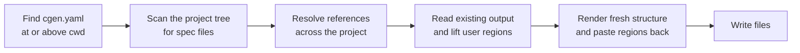

# How it works

A short mental model of what CGen does on every run. Read this once and the rest of the
documentation will feel obvious.

## The three kinds of file

| File | Who owns it | What it is |
| --- | --- | --- |
| `cgen.yaml` | You | Project root marker and generator-wide preferences. |
| `*.<kind>.yaml` | You | One spec per generated component: `.interface.yaml`, `.module.yaml`, `.state-machine.yaml`, `.observer.yaml`, `.command-table.yaml`, `.status-codes.yaml`, `.adapter.yaml`. |
| `*.h` / `*.c` | CGen, **except inside user regions** | The generated output. |

A spec file and its generated C always live in the same directory. There is no output folder and
no path configuration: to move generated files, move the YAML.

## What a `generate` run does



1. **Find the project root.** CGen walks up from the directory you are in until it finds a
   `cgen.yaml`. That file's `format` and `documentation` settings apply to everything generated in
   this run.
2. **Scan the tree.** Every spec file under the scanned directory is collected. A subdirectory
   with its own `cgen.yaml` is a [nested project](../guide/nested-projects.md) and is skipped
   entirely.
3. **Resolve references.** `implements:`, an observer's `interface:`, an adapter's `from:`/`to:`
   are matched by name across the whole project, not by path, so specs can be laid out however
   suits you.
4. **Lift the user regions.** For each output file that already exists, CGen reads the text
   between every `usercode+` / `usercode-` pair and keeps it, keyed by region name.
5. **Render and merge.** The structure is rendered fresh from the spec, and each region's saved
   text is pasted back into the region with the same name.
6. **Write.** A file is only written when CGen's own marker is on its first line. Anything else is
   refused rather than overwritten.

## The two kinds of marker

Generated files carry two visually distinct marker styles, and the difference matters:

```c
/*@CGen(private-function:ra_iic_common_iic_write)*/   /* (1)! */
static common_iic_status_t ra_iic_common_iic_write(void *context, uint32_t length)
{
    common_iic_status_t cgen_result = COMMON_IIC_INVALID_PARAM;

    /*@CGen usercode+ function.common_iic.write.body*/  /* (2)! */
    /* yours */
    /*@CGen usercode-*/
    return cgen_result;
}
```

1.  **Structural marker** — `/*@CGen(...)*/`. CGen's bookkeeping. It tells the next run what the
    following block is. Do not edit it or the code it labels.
2.  **User region** — `usercode+` ... `usercode-`. Yours. Everything between the two lines is
    preserved verbatim across every regeneration.

Region names are predictable and derived from the spec: `function.<interface>.<function>.body`,
`state.<STATE>.entry`, `command.<NAME>.body`, `variable.<name>.get`, and so on. Each generator
page lists the regions it produces.

## What happens when the spec changes

| Change in YAML | Effect on the generated C |
| --- | --- |
| Add a function, state, command, … | A new empty user region appears; every existing region is untouched. |
| Rename an item | Treated as a removal plus an addition — the old region is kept as an orphan, so you can move the code across by hand. |
| Remove an item | Its structure disappears; **its user region is retained as an orphan** rather than silently deleted. |
| Change a parameter or return type | The signature is rewritten around your body. Your body is unchanged, so fix it up if it no longer compiles. |
| Change `format` in `cgen.yaml` | Everything is re-rendered in the new style, regions carried across as usual. |

The rule behind all of it: **CGen never deletes code you wrote.** The worst it will do is leave it
somewhere it no longer belongs, clearly marked, for you to deal with.

## Regenerating is meant to be routine

There is no incremental mode and no cache to invalidate — `CGen generate` is idempotent. Running
it twice in a row produces identical files the second time. Run it after any YAML edit, wire it
into a pre-build step if you like, and keep both the YAML and the generated C in version control
so reviewers see the real diff of what changed.

## Leaving

CGen is a starting point, not a dependency. [`CGen detach`](../reference/cli.md#cgen-detach)
removes every marker line, deletes the spec files and `cgen.yaml`, and leaves ordinary C behind.
Nothing you have to keep running.
